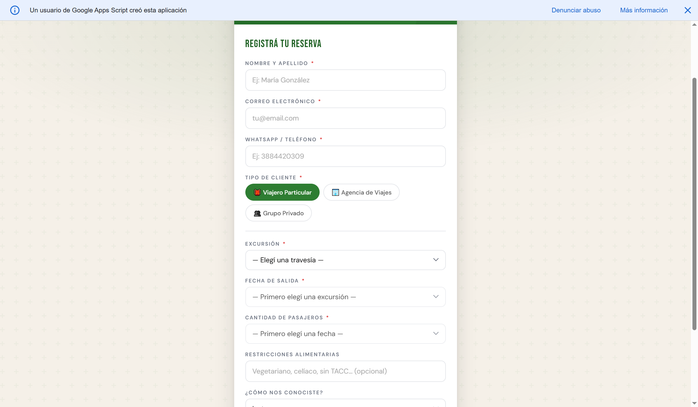
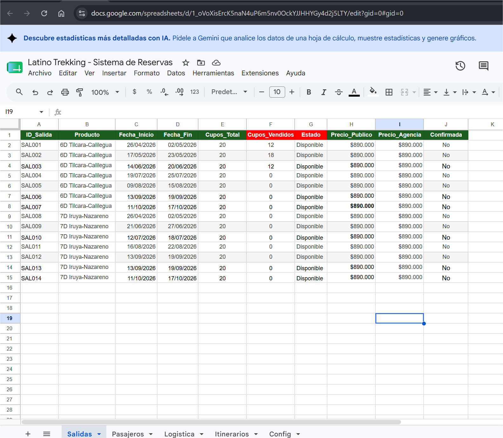
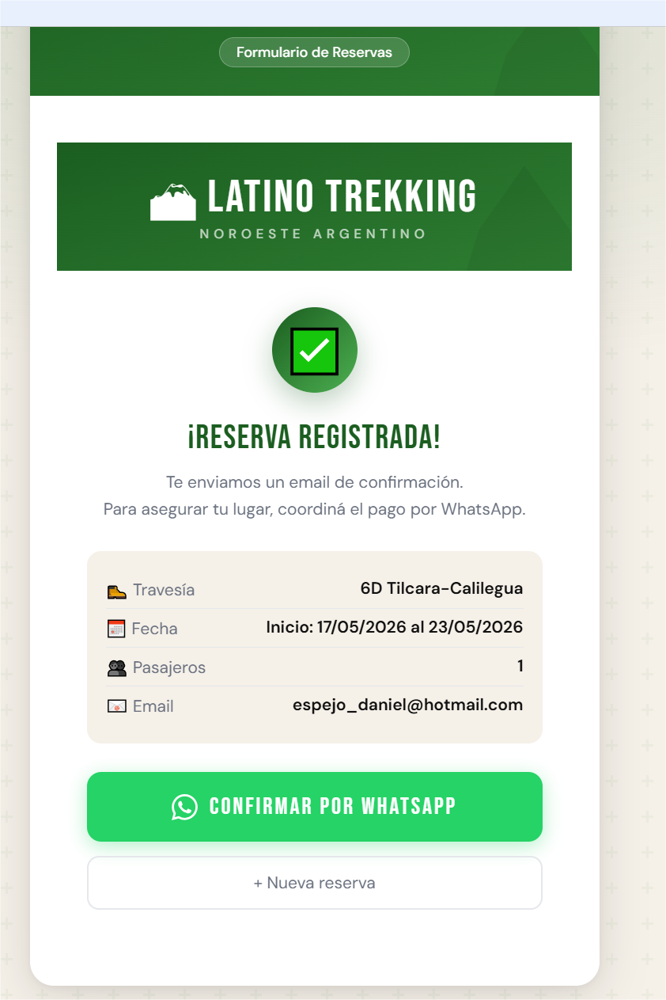
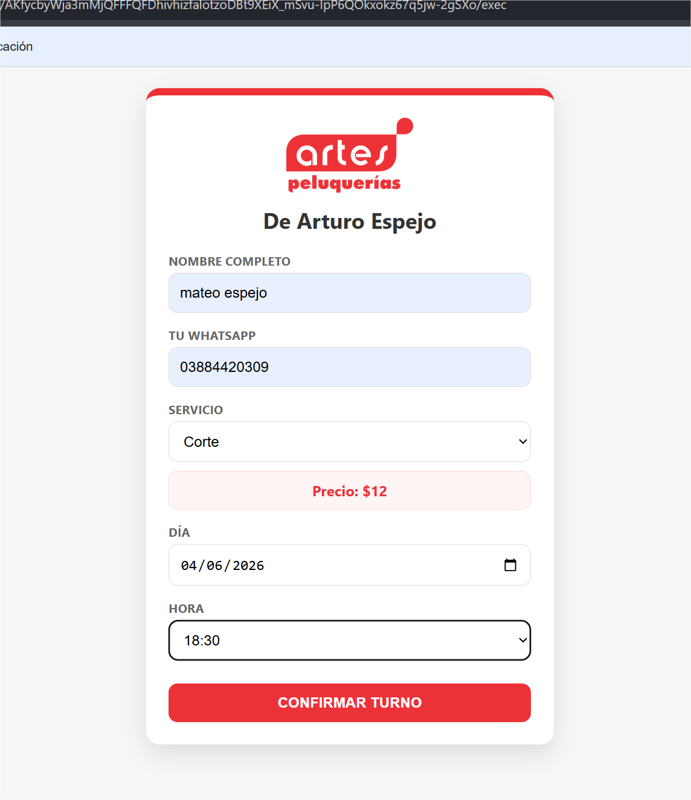
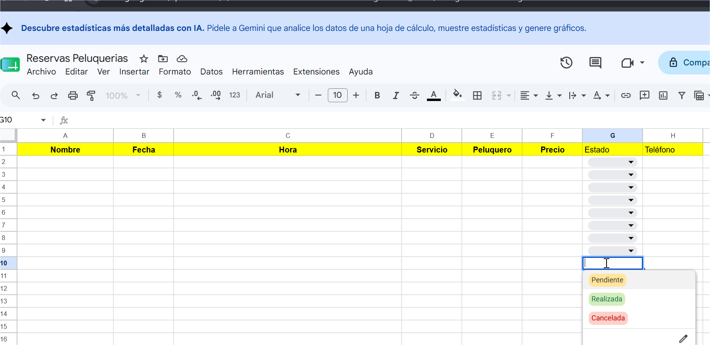
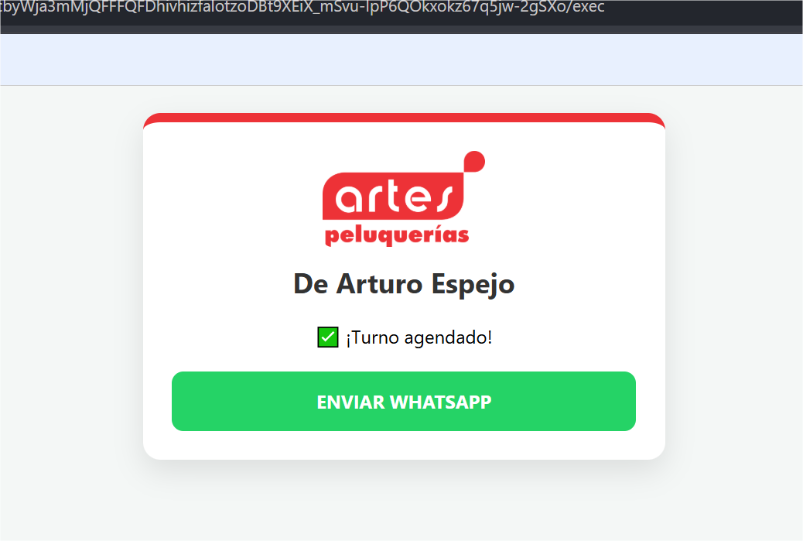

# 🗂️ Portfolio – Daniel Altura

Diseñador en Comunicación Visual y con especialización en análisis de datos y mas de 20 años de experiencia en proyectos públicos y privados.

---

## 🚐 Jana Transportes – Formulario de Viajes

**Tipo de proyecto:** Aplicación web para gestión operativa  
**Cliente:** Jana Transportes – San Salvador de Jujuy, Argentina  
**Estado:** En desarrollo / etapa de pruebas

### 📌 Descripción
Sistema web para la gestión de solicitudes de viajes y traslados corporativos.
Permite registrar pedidos, calcular tarifas y administrar el historial 
de servicios desde una interfaz simple y accesible.

### ⚙️ Tecnologías utilizadas
- HTML5 / CSS3 / JavaScript
- Panel de administración con dashboard integrado
- Módulo de cierre y registro de viajes
- Deploy en Vercel (producción continua)
- Control de versiones con GitHub

### 🎯 Objetivos del proyecto
- Digitalizar el proceso de solicitud y seguimiento de traslados
- Centralizar la información operativa del servicio
- Reducir tiempos de gestión administrativa

---

*Repositorio privado — disponible para revisión bajo solicitud.*

---

## 🏔️ Sistema de Reservas – Excursiones Turísticas

**Tipo de proyecto:** Automatización de reservas y gestión de turnos  
**Sector:** Turismo / Agencia de viajes  
**Estado:** Operativo

### 📌 Descripción
Sistema de reservas online para excursiones turísticas. 
Permite a los clientes reservar su lugar desde un formulario web, 
registrando automáticamente los datos en una planilla de gestión 
con notificaciones instantáneas al cliente y al operador.

### ⚙️ Tecnologías utilizadas
- Google Forms (interfaz de reserva)
- Google Sheets (base de datos y gestión)
- Google Apps Script (automatización y lógica)
- Envío automático de emails de confirmación
- Notificaciones por WhatsApp

---

## ✂️ Sistema de Turnos – Peluquería

**Tipo de proyecto:** Gestión de turnos con notificaciones automáticas  
**Sector:** Servicios / Comercio  
**Estado:** Operativo

### 📌 Descripción
Sistema de gestión de turnos para peluquería. Los clientes solicitan 
su turno online y reciben confirmación automática por email y WhatsApp, 
reduciendo ausencias y optimizando la agenda del negocio.

### ⚙️ Tecnologías utilizadas
- Google Forms (solicitud de turno)
- Google Sheets (agenda y registro)
- Google Apps Script (automatización)
- Notificaciones automáticas por email y WhatsApp

---

