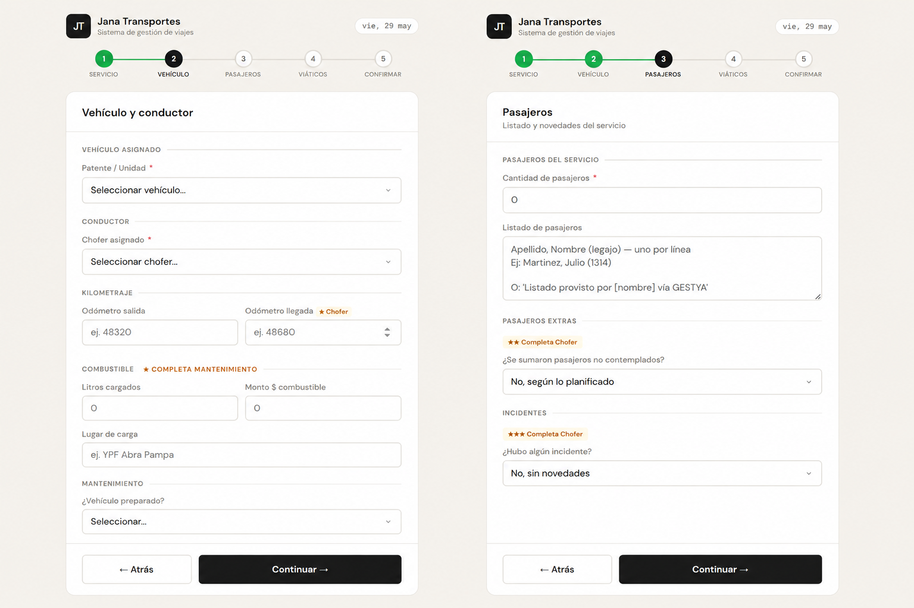
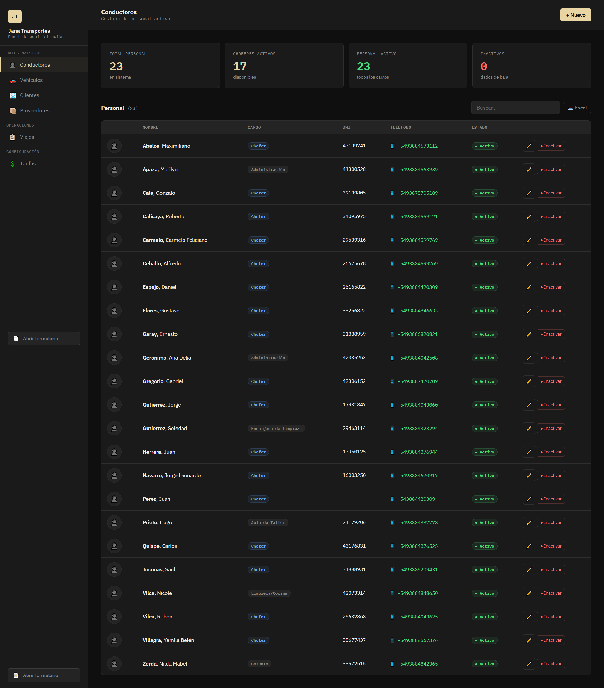
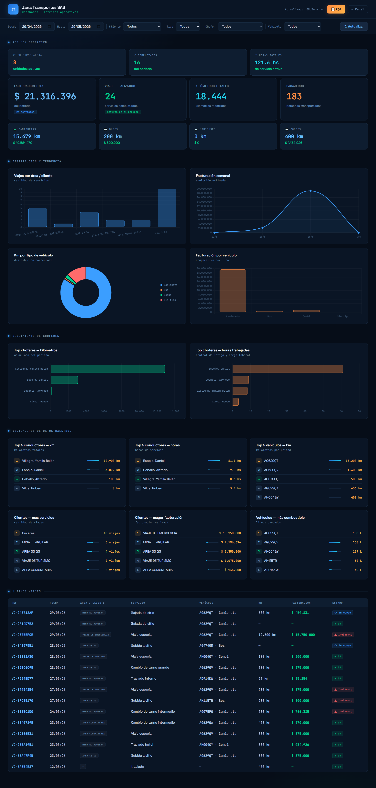
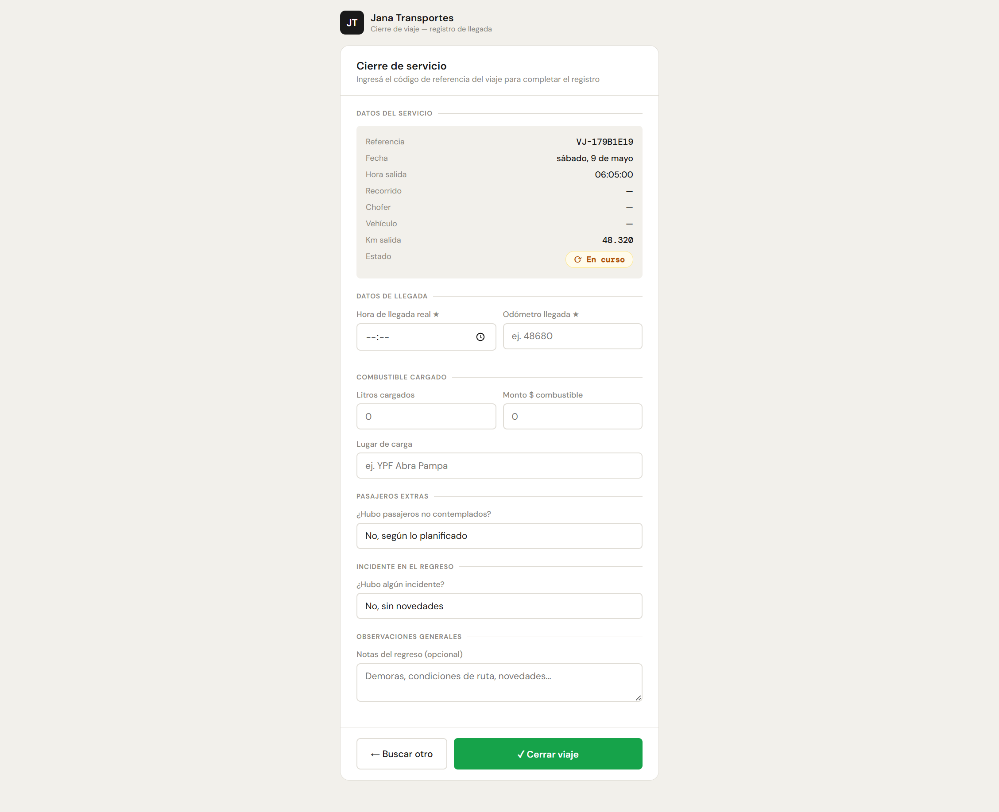

# 🗂️ Portfolio – Daniel Altura

Diseñador en Comunicación Visual y con especialización en análisis de datos y mas de 20 años de experiencia en proyectos públicos y privados.

---

## 🚐 Jana Transportes – Formulario de Viajes

**Tipo de proyecto:** Aplicación web para gestión operativa  
**Cliente:** Jana Transportes – San Salvador de Jujuy, Argentina  
**Estado:** En desarrollo / etapa de pruebas

### 📌 Descripción
Sistema web para la gestión de solicitudes de viajes y traslados corporativos.
Permite registrar pedidos, calcular tarifas y administrar el historial 
de servicios desde una interfaz simple y accesible.

### ⚙️ Tecnologías utilizadas
- HTML5 / CSS3 / JavaScript
- Panel de administración con dashboard integrado
- Módulo de cierre y registro de viajes
- Deploy en Vercel (producción continua)
- Control de versiones con GitHub

### 🎯 Objetivos del proyecto
- Digitalizar el proceso de solicitud y seguimiento de traslados
- Centralizar la información operativa del servicio
- Reducir tiempos de gestión administrativa

---

*Repositorio privado — disponible para revisión bajo solicitud.*

